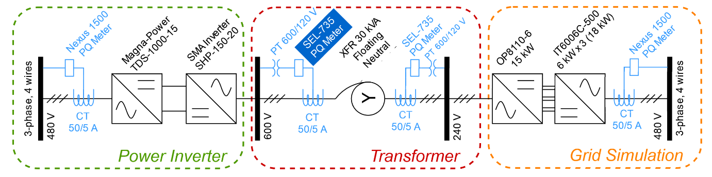
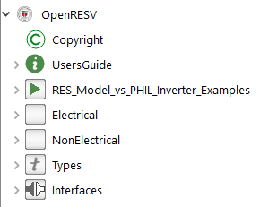
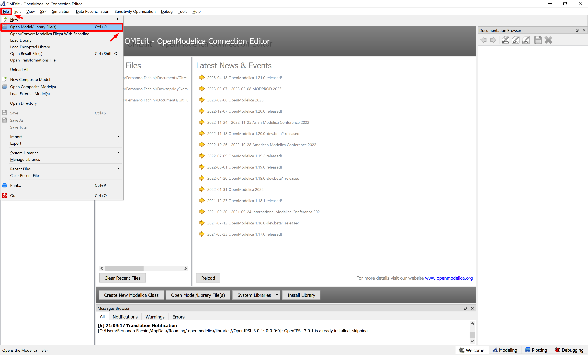
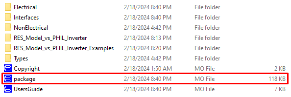

# OpenRESV - Open Instance Renewable Energy Source Validation
## Scope
The OpenRESV is an open-source Modelica-based library that is focused on modeling and validation of WECC-based renewable energy models. It was built using the Modelica language, leveraging the Modelica Standard Library. 
In order to facilitate the 
This Modelica Library explores the potential of Power Hardware-in-the-Loop (PHIL) setups for model validation, comparing an actual inverter with generic renewable energy source (RES) models from the Western Electricity Coordinating Council (WECC). 
Utilizing PHIL experimental data, the study not only validates and tests WECC models but also proposes enhancements to improve real-world inverter representation. 
The suggested improvements include three features: a voltage ride-through logic, an irradiance-to-active-power module, and an update to the voltage proportional control logic. 
The first two additions are extra components, preserving the original structure of WECC RES models and respecting the efforts of the modeling team. 
The last feature slightly modifies the model to enhance the reactive power response for a better match with experimental data. 
The upgraded models were implemented using the open-source Modelica language and the OpenIPSL Modelica Library, encouraging collaborative contributions for accelerated model development. 
To round everything off, a comprehensive comparison and validation against a real PV inverter in laboratory settings, offering an extensive set of simulations and comparisons to existing literature.

We have submitted a paper to the IEEE Transactions on Energy Conversion, which we would welcome you to cite as:

> Fachini, Fernando, et al. "Customized Open-Source Renewable Energy Models Validated through PHIL Lab Experiments" IEEE Transactions on Energy Conversion (2024)

## Review of the ALSETLab Volta Facility

PHIL testing, particularly for power electronics systems like smart inverters, has gained popularity due to its advantages over traditional testing methods.
The ALSETLab research team at Rensselaer Polytechnic Institute established the [ALSETLab Volta Facility](https://alsetlab.github.io/lab/ "Volta's Homepage") to facilitate research and development in power electronics systems.
This power hardware-in-the-loop laboratory is designed for testing inverter functionality at a 15 kW capacity, utilizing Opal-RT simulators and a 4-quadrant bi-directional controllable power converter from Opal-RT.
The PHIL setup was conceptualized such the researcher is capable of testing the inverter in different control modes, such as volt-var mode and constant power factor (PF) mode.
The figure bellow illustrates the electrical design schematic of the lab, showcasing the components that make up the equipment setup: Power Inverter, Transformer, and Grid Simulation.

The Sunny Highpower SHP-150-20 inverter is located in the Power Inverter group, thus power flows from the power inverter in direction to the grid simulation group, passing through a 30 kVA 125 Maddox three-phase dry-type auto-transformer. The SEL-735 PQ Meter is the meter used by the authors to collect experiment data for the purpose of the inverter model validation.
The power amplifier (OP8100 4-Quadrant power amplifier) has been employed with a capability to absorb or inject 15 kVA of power. This amplifier serves as a power grid emulator for the connected PV inverter. 
A common method for providing DC voltage/current to the smart inverter and replicating the behavior of a photovoltaic (PV) array during equipment testing is to utilize a DC power supply. 
The lab setup utilizes a Magna-Power programmable DC power supply, which provides programmable voltage, current, protection settings, and accurate measurements. 
The recreation of a photovoltaic power profile is conducted utilizing a photovoltaic power profile emulator (PPPE). 
The PPPE software automatically produces solar array voltage and current profiles according to predefined parameters. 
These profiles are then sequentially provided to the Magna-Power supply for emulation.

In case the reader would like to read more about the Volta Facility, [folder](docs/Lab_Documents "Folder with all the documents for the equipment utilized in the implementation of the Volta Facility") contains additional information.

## OpenRESV Library Structure
The library is structured into five sub-packages (illustrated in Figure shown below): Examples, NonMultiDomain, MultiDomain, Controls, and Functions.\

- **RES_Model_vs_PHIL_Inverter_Examples:** contains Modelica model examples of all the validation tests conducted on the ALSETLab Volta PHIL Setup.
- **Electrical:** contains the bare minimum electrical components (from the OpenIPSL library) necessary for running the simulations.
-  **NonElectrical:**  contains the bare minimum nonelectrical components (from the OpenIPSL library) necessary for running the simulations.
-  **Types:** contains variable types created in OpenIPSL and extended in this library.
-  **Interfaces:** interfaces used in the models.

## How to run an example in OpenModelica?

### **Step 1.** Download and Install OpenModelica 
OpenModelica is an open-source and free Modelica-based modeling and simulation environment intended for industrial and academic usage. To download the latest version of the software, click on: [Windows Version](https://openmodelica.org/download/download-windows/) or [Linux Version](https://openmodelica.org/download/download-linux/).

### Step 2. Loading OpenRESV
In order to load OpenRESV, you have to know the folder where you downloaded the library. You should go to *File>Open Model/Library File(s)* and search for the folder where you downloaded OpenRESV. Once you have found the folder, you must load the **package.mo** file.

### Step 4. Running an Example
Now that you have loaded both OpenIPSL and OpenIMDML, we can start running some examples.
Under Libraries Browser, click on *OpenIMDML>Examples>MultiDomainExamples>MultiDomainThreePhaseInductionMotors>MultiDomainThreePhaseMotorValidation>MultiDomainTypeI*. You should expect to see the screen below. On the right-hand side of the figure below is the Documentation Browser, where the user can read more about the selected example.

Next step is to click on *Simulate*.

To display the simulation results, you must type the name of the variable you wish to plot. Use the names of the variables of interest from the Documentation Browser to select a variable to plot.
For instance, type in Variables Browser the variable **Motor1.s** and then select the variable. The plot displayed is the motor slip value.

## Copyright and License Information

**OpenIMDML:** Copyright February 2024 - current, [Fernando Fachini](https://github.com/fachif) and [Luigi Vanfretti](https://github.com/lvanfretti), [ALSETLab](https://github.com/ALSETLab), Rensselaer Polytechnic Institute, Troy, NY.

The authors can be contacted by email: <a href="mailto:emaildofachini@gmail.com?subject=OpenIMDML_License">emaildofachini@gmail.com</a>.

This Source Code Form is subject to the terms of the [3-Clause BSD license](https://opensource.org/licenses/BSD-3-Clause).

## Acknowledgements

The development of the OpenRESV library is based upon work supported by the U.S. Department of Energy’s Office of Energy Efficiency and Renewable Energy (EERE) under the Advanced Manufacturing Office, Award Number DE-EE0009139.
